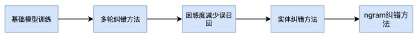
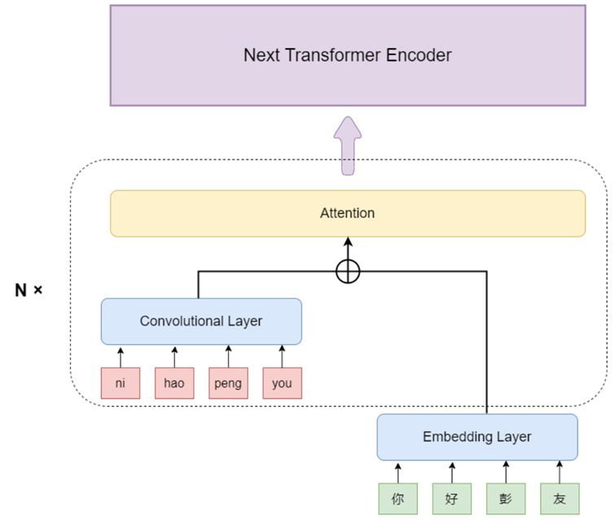

# 文本纠错
主要按照`全国中文纠错大赛达观冠军方案分享：多模型结合的等长拼写纠错`复现一下流程

## 拼音编码基础模型

采用拼音和汉字混合编码的形式  
拼音: 每个拼音组合首先会被编码成一个独一无二的整数，输入模型后，将拼音经过Convolutional layer后的矩阵与文本经过Embedding Layer之后的矩阵相加，再输入Attention层，以此强化拼音编码在模型中的权重。  
首先借鉴了DCN的做法  

# 参考资料
* [全国中文纠错大赛达观冠军方案分享：多模型结合的等长拼写纠错](https://cloud.tencent.com/developer/article/2197920)
* [nlp-fluency](https://github.com/baojunshan/nlp-fluency)
* [ChineseErrorCorrector](https://github.com/TW-NLP/ChineseErrorCorrector)
* [DCN](https://github.com/destwang/DCN)
* [FASPell_paper](https://aclanthology.org/D19-5522.pdf)
* [FASPell](https://github.com/iqiyi/FASPell)