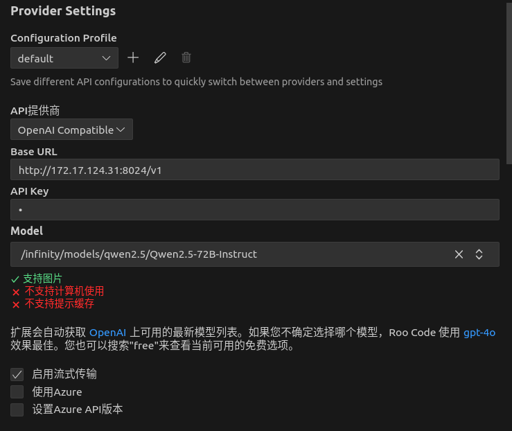
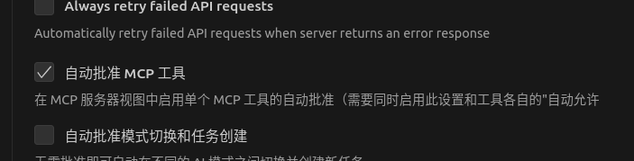
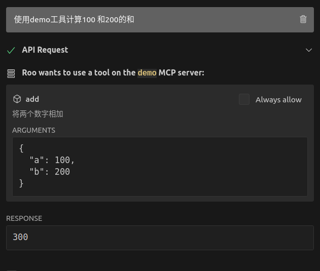

# MCP  
## stdio
### 测试
* VSCODE安装ROO CODE CHINESE
* 配置模型  

* 允许MCP  

* 配置mcp_settings  
* 问答页面  
  

要将此服务器注册到Claude Desktop，可以使用FastMCP的CLI工具：```fastmcp install calculator_stdio.py```

## sse
### 测试
* 启动服务端，获取服务链接（例如http://127.0.0.1:8000/sse）
```python weather_sse.py```  
* 启动客户端
```./Cherry-Studio-1.2.10-x86_64.AppImage``` 
* 配置MCP  
    - 点击左下角的`设置`按钮，点击列表中的`MCP服务器`按钮  
    - 点击`添加服务器`按钮，主要配置名称、类型(sse)、URL(服务链接)  
    - 点击左上角`助手`，新建助手，对话框下面的按钮中找到`MCP 服务器`配置上面的服务器  
    - 同时还可以配置模型以及其他

## 参考资料
* [Python FastMCP实现MCP实践全解析](https://blog.csdn.net/lingding_cn/article/details/147355620)