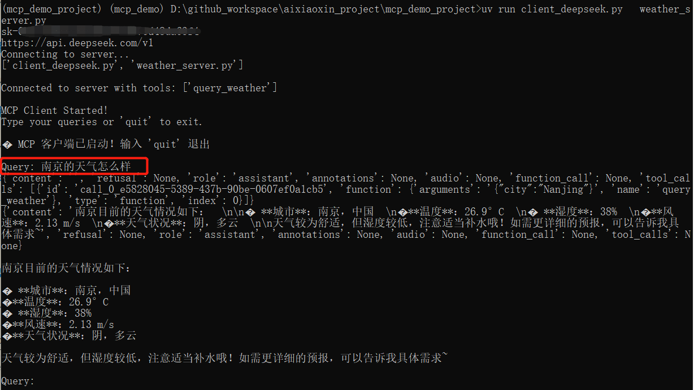
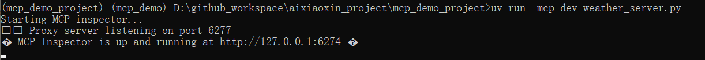
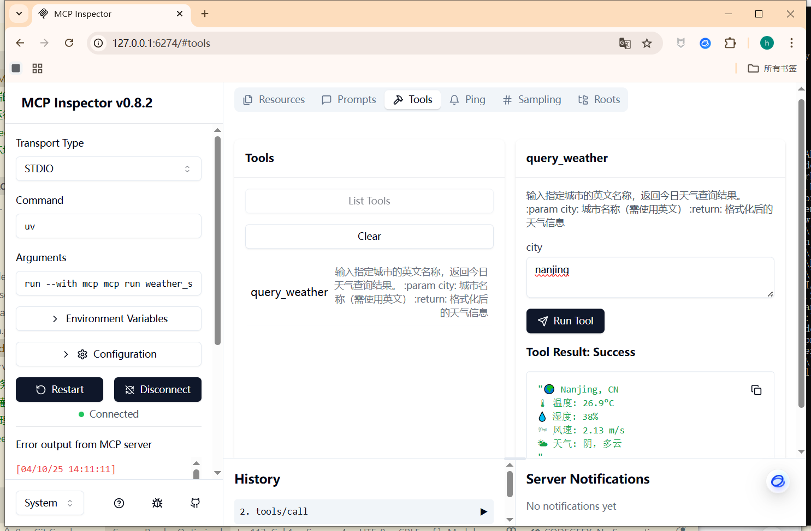
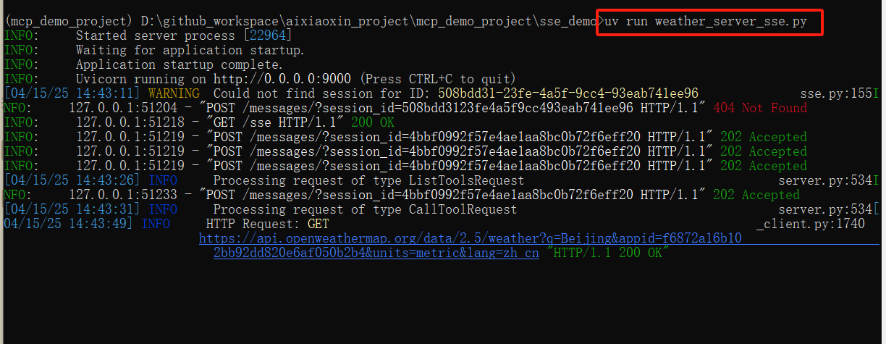
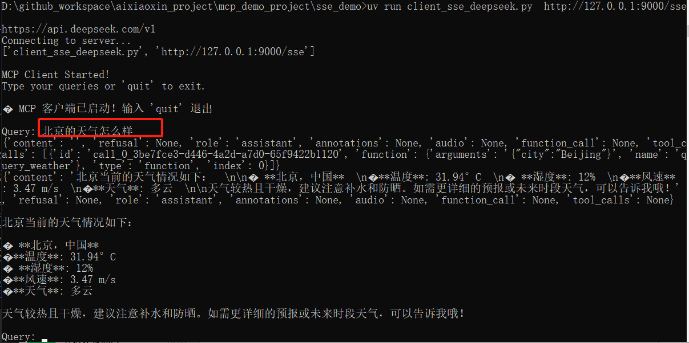

# 项目介绍
# mcp的天气查询的agent的完整示例-支持stdio模式，和 sse两种模式，提供的webui可视化界面，方便mcp的问答；

v1.2 版本 更新
新增webui界面，方便用户问答；
支持配置多个sse的服务端；


v1.1 版本 更新
支持sse、stdio两种模式；
支持claude、openai、deepseek、qwen等大模型；
天气查询api，采用  openweathermap 
可以访问openweathermap的网址，获取apikey；   
网址：   https://home.openweathermap.org/subscriptions

作者公众号： AI小新  ， 有问题，可以加群交流；关注公众号，发送数字2，获取小助手微信；

公众号：


小助手微信：


# 下面开始部署教程


```bash
# 下载代码

git clone  https://github.com/aixiaoxin123/mcp_demo_project.git

```


# 进入代码目录
cd mcp_demo_project


# 创建conda环境

conda create -n mcp_demo  python=3.10

conda activate mcp_demo

# 安装uv 工具
pip install uv  -i https://pypi.tuna.tsinghua.edu.cn/simple/

uv --version


# 利用uv 在当前目录，创建一个虚拟环境
uv venv

# 激活虚拟环境
# linux 下命令
source .venv/bin/activate

# windows 下命令(作者用的此命令)
.venv\Scripts\activate


# uv 安装对应的依赖包
uv pip install  -r requirements.txt  -i https://pypi.tuna.tsinghua.edu.cn/simple/ 


截图：


# 启动mcp服务


## 运行 客户端和本地服务端

###   配置.env 文件，填入你的大模型密钥


## 一、stdio模式的示例，下面会介绍sse模式的示例

### 利用deepseek大模型进行问答

#### 进入 stdio_demo 的文件夹
cd stdio_demo 


####  运行客户端和本地服务端
uv run client_deepseek.py   weather_server.py


运行截图：
问题：北京的天气怎么样？



### 利用claude大模型进行问答

uv run client_claude.py   weather_server.py


运行截图：
问题：北京的天气怎么样？
uv run client_deepseek.py   weather_server.py


### 利用qwen大模型进行问答

uv run client_qwen.py   weather_server.py

### 利用openai模型进行问答

uv run client_openai.py   weather_server.py


### 运行deepseek的截图


## 当然你也可以单独运行 mcp服务端[stdio模式]

uv run  mcp dev weather_server.py


运行截图：



运行成功后，可以访问：
http://127.0.0.1:6274

服务端的管理界面：


服务端-工具列表使用截图：



## 二、sse模式mcp的示例

### 1、运行sse的服务端  weather_server_sse.py


```bash
#进入sse_demo 的文件夹
cd sse_demo 

#运行sse的服务端，端口默认为9000

uv run weather_server_sse.py

```


运行截图：



### 2、利用ollama本地大模型进行问答

uv run client_sse_ollama.py  http://127.0.0.1:9000/sse


### 3、运行deepseek的mcp 客户端 连接sse服务端

uv run client_sse_deepseek.py  http://127.0.0.1:9000/sse


运行截图：
问题：北京的天气怎么样？



## 三、mcp的webui界面

### 1、运行webui界面

```bash
#进入webui_demo 的文件夹
cd mcp_webui_demo 

#运行webui界面，端口默认为7860


uv run webui_deepseek.py

```
### 2、使用教程

访问界面：
http://localhost:7860/

输入问题：帮我查找 知识图谱 相关的最新的论文

支持：实时返回结果；

运行结果截图：


在 魔塔的mcp社区，选择合适的mcp服务；

https://modelscope.cn/mcp


配置mcp的服务端：


或者修改 mcp.json 文件；


# 四、docker部署mcp的webui的教程(不推荐这种方式，dockerfile，国外源，下载速度很慢)


文件目录：
```bash
mcp_demo_project/
        mcp_webui_demo/
        │
        ├── webui_deepseek.py
        ├── requirements.txt
        ├── Dockerfile
        ├── .env                <-- 将被挂载
        ├── mcp.json            <-- 将被挂载
```


进入当前目录：
cd  mcp_webui_demo

🐳 使用方式
1. 构建镜像：

```bash
docker build -t mcp-webui .

```


2. 运行容器：

🐳 启动容器时挂载：

```bash
docker run -it --rm \
  -v $(pwd)/.env:/app/.env \
  -v $(pwd)/mcp.json:/app/mcp.json \
  -p 7860:7860 \
  mcp-webui
```


# 参考教程：
mcp官方的文档：
https://mcp-docs.cn/introduction