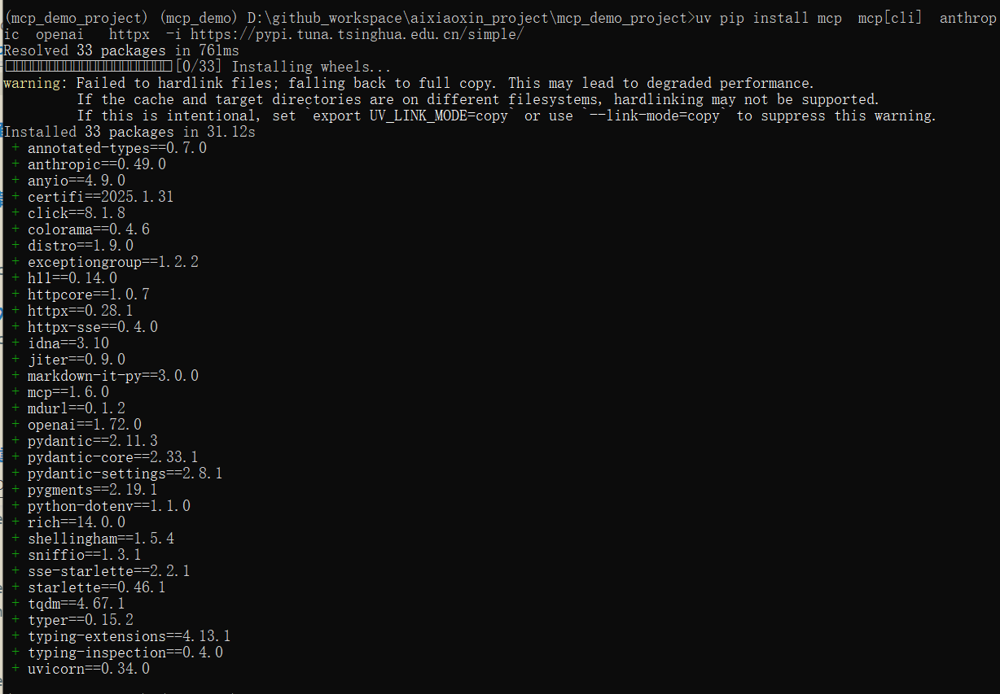
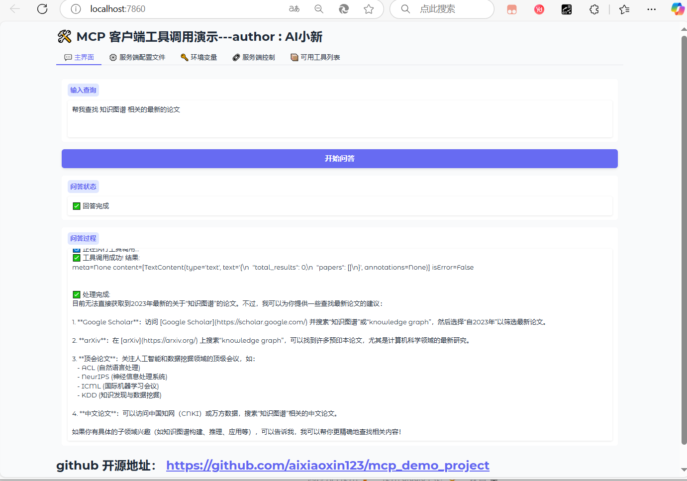
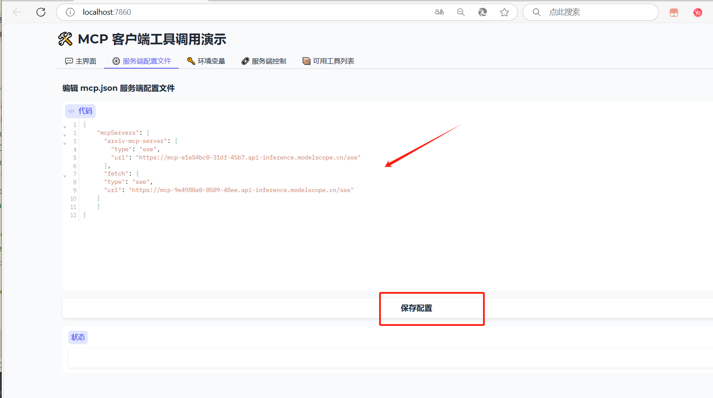

# 项目介绍
# mcp的webui 可视化界面，支持连接多个sse的mcp服务端；

v1.2 版本 更新
新增webui界面，方便用户问答；
支持配置多个sse的服务端；


作者公众号： AI小新  ， 有问题，可以加群交流；关注公众号，发送数字2，获取小助手微信；


# 下面开始部署教程


```bash
# 下载代码

git clone  https://github.com/aixiaoxin123/mcp_demo_project.git

```


# 进入代码目录
cd mcp_demo_project


# 创建conda环境

conda create -n mcp_demo  python=3.10

conda activate mcp_demo

# 安装uv 工具
pip install uv  -i https://pypi.tuna.tsinghua.edu.cn/simple/

uv --version


# 利用uv 在当前目录，创建一个虚拟环境
uv venv

# 激活虚拟环境
# linux 下命令
source .venv/bin/activate

# windows 下命令(作者用的此命令)
.venv\Scripts\activate


# uv 安装对应的依赖包
uv pip install  -r requirements.txt  -i https://pypi.tuna.tsinghua.edu.cn/simple/ 


截图：



# 启动mcp的webui服务


###   配置.env 文件，填入你的大模型密钥

修改你的 DEEPSEEK_API_KEY 的值，替换成你的大模型密钥；


## mcp的webui 可视化界面

### 1、运行webui界面

```bash
#进入webui_demo 的文件夹
cd mcp_webui_demo 

#运行webui界面，端口默认为7860


uv run webui_deepseek.py

```
### 2、使用教程

访问界面：
http://localhost:7860/

输入问题：帮我查找 知识图谱 相关的最新的论文

支持：实时返回结果；

运行结果截图：


在 魔塔的mcp社区，选择合适的mcp服务；

https://modelscope.cn/mcp


配置mcp的服务端：


或者修改 mcp.json 文件；


# 参考教程：
mcp官方的文档：
https://mcp-docs.cn/introduction