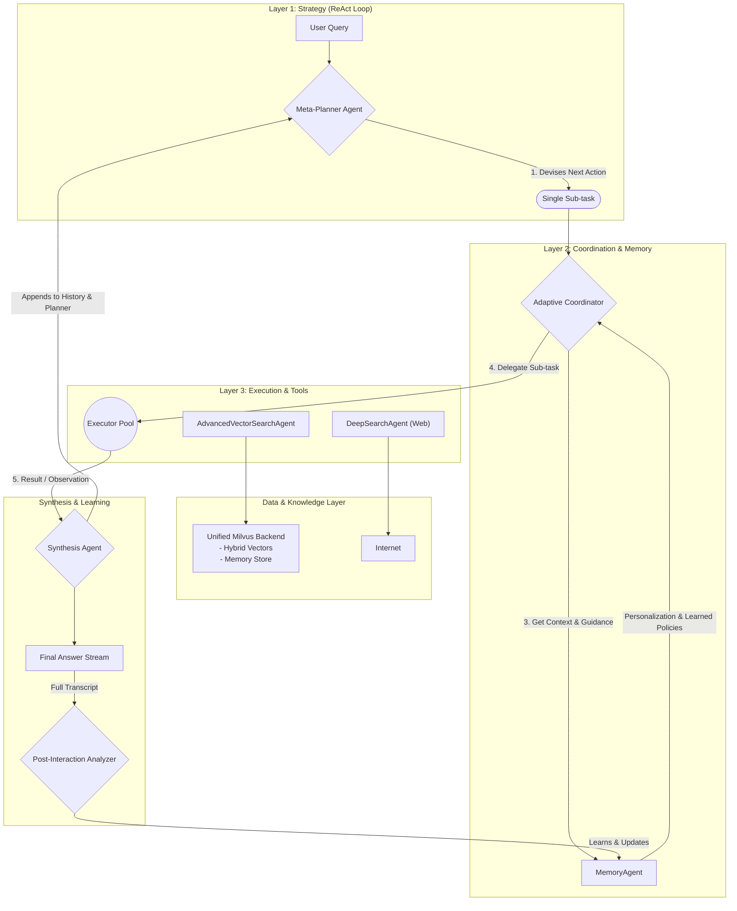

 

# HyDRA: Hybrid Dynamic RAG Agents

**An advanced, agentic AI framework that transforms Retrieval-Augmented Generation from a static pipeline into a dynamic, learning reasoning system.**

<p align="center">
  <a href="https://github.com/hassenhamdi/HyDRA/stargazers">
    
  </a>
  <a href="https://github.com/hassenhamdi/HyDRA/blob/main/LICENSE">
    
  </a>
  <a href="https://www.python.org/downloads/release/python-3100/">
    
  </a>
  <a href="https://milvus.io/">
    
  </a>
</p>

[HyDRA Website](https://hassenhamdi.github.io/HyDRA/)
---

## Announcement:
- New release more powerful overhaul  :  for full changelog check [Changelog.md](./docs/changelog.md) 

## 🎬 Project Demo

See HyDRA in action! This video showcases the iterative reasoning process, the dynamic TUI, and the agent's ability to learn and adapt.
(😁 Rest assured The noisy logging output suppression is on the roadmap.) 

https://github.com/user-attachments/assets/327a96a7-e45e-474c-9984-9d63032d5378


---

## Table of Contents
- [Why HyDRA?](#why-hydra)
- [The HyDRA Approach](#-the-hydra-approach)
  - [1. Hierarchical Agents](#1-hierarchical-agents)
  - [2. Iterative Reasoning (ReAct)](#2-iterative-reasoning-react)
  - [3. Autonomous Learning (HELP/SIMPSON)](#3-autonomous-learning-helpsimpson)
- [✨ Core Features](#-core-features)
- [Architectural Overview](#-architectural-overview)
- [🛠️ Technical Deep Dive](#️-technical-deep-dive)
- [🚀 Installation & Setup](#-installation--setup)
- [💻 Usage](#-usage)
- [📝 Future Roadmap](#-future-roadmap)
- [🤝 Contributing](#-contributing)
- [Acknowledgements & Foundational Work](#-acknowledgements--foundational-work)
- [License](#license)

---

## Why HyDRA?

The world of Retrieval-Augmented Generation is evolving at a breakneck pace. Groundbreaking ideas are published monthly, but they often exist in isolation within academic papers or specific repositories. **HyDRA was born from a simple question: What would a system look like if we fused the best of these ideas into a single, cohesive, and practical framework?**

HyDRA is an ambitious attempt to synthesize and build upon the core principles of several leading-edge projects:

*   It adopts the robust, three-layer agentic structure from **HiRA** for a clean separation of strategy and execution.
*   It implements the multi-agent, multi-source retrieval philosophy of **HM-RAG**.
*   It leverages the **HyDE** technique to bridge the semantic gap between user queries and stored documents.
*   It is powered by **Milvus**, used not just as a vector store but as a unified backend for hybrid search, RRF reranking, and agent memory.
*   It utilizes the full potential of the **BGE-M3** model for state-of-the-art dense and sparse embeddings.

HyDRA is our answer to building a RAG system that is not just powerful, but also intelligent, adaptive, and architecturally sound.

## 🧠 The HyDRA Approach

HyDRA's intelligence is built on three foundational pillars that work in concert:

### 1. Hierarchical Agents
A clear separation of concerns ensures robust and predictable behavior.
- **Meta-Planner:** The strategist. It analyzes the user's query and the conversation history to determine the next logical step.
- **Adaptive Coordinator:** The manager. It receives a task from the planner and delegates it to the most suitable specialist agent, guided by past performance data.
- **Executors:** The specialists. A pool of agents with distinct tools, such as the `AdvancedVectorSearchAgent` for querying the internal knowledge base or the `DeepSearchAgent` for performing live web research.

### 2. Iterative Reasoning (ReAct)
Unlike traditional RAG pipelines that execute a fixed plan, HyDRA employs a dynamic **Reasoning-Acting loop**.
1.  The `Meta-Planner` observes the current state and decides on the single best **action** to take next.
2.  The `Coordinator` delegates this action to an `Executor`, which performs the task (e.g., a web search).
3.  The result, or **observation**, is returned and appended to the history.
4.  The loop repeats, with the planner using the full history of actions and observations to inform its next decision.

This allows HyDRA to tackle complex, multi-hop questions, recover from failed steps, and adjust its strategy on the fly.

### 3. Autonomous Learning (HELP/SIMPSON)
The **Heuristic Experience-based Learning Policy (HELP)** system is HyDRA's long-term memory and self-improvement mechanism. After every user interaction, a four-stage learning cycle begins:
1.  **Observe:** The `PostInteractionAnalyzer` agent reviews the full transcript of the conversation.
2.  **Critique:** It evaluates the efficiency of each step, identifying which agent delegations were successful and which were not.
3.  **Memorize:** It formulates and stores a concise, actionable "policy" in its Milvus memory (e.g., *"For recent events, web search is more effective than vector search"*). It also learns the user's implicit preferences (e.g., *"Prefers bullet-pointed lists"*).
4.  **Adapt:** The next time the `AdaptiveCoordinator` faces a similar task, it retrieves this learned policy as "strategic guidance," enabling it to make smarter, experience-based decisions.

---

## ✨ Core Features

-   ✅ **Three-Layer Agentic Architecture:** `Meta-Planner` for strategy, `AdaptiveCoordinator` for delegation, and specialized `Executors` for task execution.
-   ✅ **Iterative ReAct-style Agents:** Moves beyond static plans to dynamic, multi-step reasoning for complex problem-solving.
-   ✅ **Continuous Self-Improvement (HELP/SIMPSON):** A long-term learning loop that analyzes past performance to optimize future agent delegation and planning.
-   ✅ **State-of-the-Art Retrieval Pipeline:** Combines **Hybrid Search** (dense + sparse vectors), **Reciprocal Rank Fusion (RRF)**, and a final **BGE Reranker** for maximum precision.
-   ✅ **Adaptive Retrieval Strategies:** The `AdvancedVectorSearchAgent` can autonomously use techniques like **HyDE** for conceptual queries or perform multiple refined searches.
-   ✅ **Interactive TUI with Streaming & Knowledge Management:** A rich Terminal User Interface with streaming responses and commands (`/save`, `/ingest`) to curate the agent's knowledge base.
-   ✅ **Configurable Deployment Profiles:** Easily switch between `development`, `production_balanced`, and `hyperscale` profiles to manage performance and resource trade-offs.

---

## 🗺️ Architectural Overview

HyDRA's workflow is a dynamic loop of strategy, execution, and learning. The `Meta-Planner` creates a step, the `Coordinator` delegates it, and `Executors` act. The `PostInteractionAnalyzer` reviews completed sessions to update the `MemoryAgent`, creating a continuous cycle of improvement.



---

## 🛠️ Technical Deep Dive

-   **Hybrid Search:** Combines semantic **Vector Search** (dense vectors for meaning) with keyword-based **Lexical Search** (sparse vectors for keywords) using the **BGE-M3** model.
-   **Reciprocal Rank Fusion (RRF):** Merges the dense and sparse search results efficiently within Milvus for a unified ranking.
-   **Reranking:** A powerful **BGE-Reranker** cross-encoder model re-ranks the fused candidates for maximum contextual relevance, ensuring the most precise results are at the top.
-   **Vector Quantization:** Supports database-level quantization (`HNSW_SQ8`, `IVF_RABITQ`) for scalable, cost-effective production deployments, configurable via profiles.
-   **Model Management:** A central `ModelRegistry` ensures that large embedding and reranker models are loaded into memory only once, optimizing resource usage.

---

## 🚀 Installation & Setup

### 1. Prerequisites
-   Python 3.10+
-   A Google Gemini API Key.
-   Docker and Docker Compose (for running Milvus).

### 2. Install Milvus Standalone (Recommended)
Choose the instructions for your operating system.

<details>
<summary><b>🐧 For Linux & macOS</b></summary>

The quickest way to get started is with the official installation script.

```bash
# Download the script
curl -sfL https://raw.githubusercontent.com/milvus-io/milvus/master/scripts/standalone_embed.sh -o standalone_embed.sh

# Start Milvus and its dependencies
bash standalone_embed.sh start

# To stop the services later
# bash standalone_embed.sh down
```
</details>

<details>
<summary><b>❖ For Windows</b></summary>

On Windows, Milvus runs via Docker Desktop with WSL2.

1.  **Ensure Docker Desktop is installed** and configured to use the WSL2 backend.
2.  **Follow the official guide:** [Milvus Docs - Install on Windows](https://milvus.io/docs/install_standalone-windows.md)
</details>

### 3. Clone HyDRA & Install Dependencies
```bash
git clone https://github.com/hassenhamdi/HyDRA.git
cd HyDRA
pip install -r requirements.txt
```

### 4. Configure Environment
Create a `.env` file from the example and add your API key. The default `MILVUS_URI` is already configured for the standard Milvus setup.
```bash
cp .env.example .env
```

### 5. Setup Milvus Collections
This script connects to your running Milvus instance and creates the necessary collections for HyDRA.
```bash
python -m src.services.milvus_setup --profile development
```

### 6. Ingest Your Data
Place your documents (at the moment it support only md files) in the `data/` directory and run the ingestion script.
```bash
# Create the directory if it doesn't exist and add your files
mkdir -p data
# ...add your documents to data/...

# Run the ingestion process
python -m data_processing.ingest --path ./data --profile development
```

---

## 💻 Usage

Launch the interactive Terminal User Interface (TUI). You can specify a user ID for personalization and a performance profile.

```bash
python main.py --profile production_balanced --user_id alex
```


Once inside, you can chat naturally or use slash commands for more control:
-   `/help`: View all available commands.
-   `/save`: Save the last generated report.
-   `/ingest`: Ingest a saved report back into the knowledge base.
-   `/new`: Start a new conversation session.

---

## 📝 Future Roadmap

Our detailed roadmap is now tracked in [`roadmap.md`](./docs/roadmap.md). Key upcoming features include comprehensive benchmarking, autonomous knowledge curation with temporal intelligence, and full multimodal support.

---

## 🤝 Contributing

We welcome contributions from the community! Whether it's reporting a bug, suggesting a new feature, or submitting a pull request, your help is appreciated. Please see our (forthcoming) `CONTRIBUTING.md` for more details.

---

## 🙏 Acknowledgements & Foundational Work

- First and foremost I praise and thank Allah.
- My family.

- HyDRA's architecture is a synthesis and extension of several groundbreaking concepts. We gratefully acknowledge the foundational work of:
    *   **HiRA:** For the three-layer hierarchical reasoning architecture. ([Paper](https://arxiv.org/abs/2507.02652))
    *   **HM-RAG:** For the multi-agent, multi-source retrieval paradigm. ([Paper](https://arxiv.org/abs/2504.12330))
    *   **HyDE:** For the hypothetical document embedding retrieval strategy. ([Paper](https://arxiv.org/abs/2212.10496))
    *   **Mem0:** For the inspiration behind agent memory systems. ([Paper](https://arxiv.org/abs/2504.19413))
    *   **BGE-M3 & Milvus:** For the core embedding and vector database technologies that power our hybrid search.

---

## License
This project is licensed under the [MIT License](./LICENSE).
