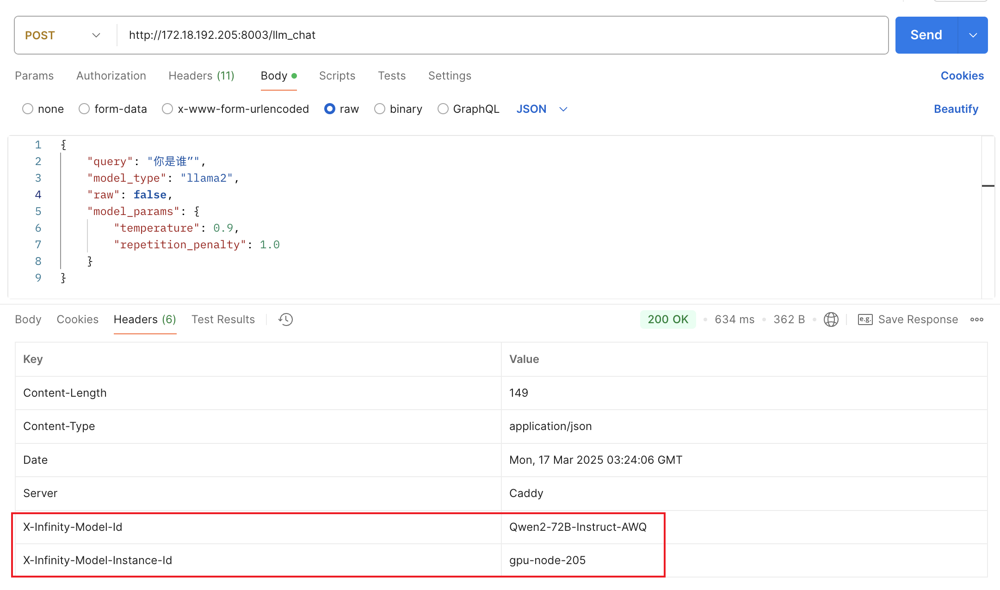

# model server

## 分支说明

master: 仅能部署大模型 LLM  
master-slm: 仅能部署小模型 SLM (Embedding、ReRanker、MdID)

## 配置

通常一次知识库问答包含 LLM 和 Embedding 各一次请求：

- LM：400ms~10s（平均 3s）
- Embedding: 50ms（1 条）、120ms（5 条）、300ms（30 条）

文档问答调用包含大量的 Embedding 请求，因此需要多副本提高性能。  
由于 LM 相应期间 GPU 仅实例化 85% 左右，且大部分情况两者是被先后调用，建议将部分 Embedding 副本与 LM 放在一起。

## 要点

### 一致性

配置 language_model 时，如使用 vLLM 需确认与模型官方 demo 有一致表现。

### 显存占用 & 并发性能

vLLM 推理时显存占用分为两部分，一部分为模型参数占用，一部分为 KV Cache 占用。  
默认 fp16 加载时，模型参数占用显存大小约等于模型文件的体积。  
KV Cache 可用空间 = 显存总量 * vram_ratio - 模型占用空间。

最大支持并发请求数 = KV Cache 可用空间 / (单 Token 占用空间 * 单请求 Token 数量)
对于未修改词表的 LLaMA 2 13B 架构模型，单 Token 占用空间约等于 1MiB。
因此可以估算 80G 显存下，vram_ratio=0.9、单请求最大 2048 token 时，最大并发约为 (80*0.9-28) / (1*2048/1024) = 22。

实际对于不同的模型，每张显卡上单 Token 的占用空间可以使用以下公式进行计算：

```
attention_count * (2 * (num_attention_heads / TP) * (hidden_size / num_hidden_layers)) * cell_size / 8 / 1024 /1024
以上变量均可以在模型目录下的 config.json 中找到

以 vicuna-13b-v1.5-16k 为例，单卡 f16 推理时单 Token 占用为：
40 * (2 * (40 / 1) * (5120 / 40)) * 16 / 8 / 1024 / 1024 = 0.78125MiB
```

### Prompt 设置

目前使用 vicuna-v1.5 时 prompt 模板为：

```json
{
  "template": {
    "sys": "A chat between a curious user and an artificial intelligence assistant. The assistant gives helpful, detailed, and polite answers to the user's questions.\nThe assistant, named '无涯', is powered by a proprietary large language model from the company '星环科技'.\nCurrent time: {}.\n",
    "user": "\nUSER: {}",
    "ai": "\nASSISTANT: {}",
    "sep": "</s>"
  }
}
```

其中 sys 为会追加在第一个 QA 对之前，程序会将当前时间格式化后填在模板末尾这一段中 `Current time: {}.\n` 。

### Embedding/ReRanker/MDiD 多副本

以以下配置为例，启动后会在序号为 2 和 3 的两张 N 卡分别各启动 2 个副本，共 2*2=4 个副本。
```json
{
  "rerank_model": {
    "bge": {
      "model_path": "/opt/share/lyj/plm/bge-reranker-large",
      "device": [
        "cuda:2",
        "cuda:3"
      ],
      "replica": 2
    }
  }
}
```

### 可观测性（Observability）配置

在`configs/common.json`配置文件中，添加如下配置，可以开启模型服务的 Telemetry 模式：

```json
{
    "telemetry": {
        "enable": true,
        "instance_id": "Instance id, e.g. gpu-node-xxx",
        "model_id": "Model id, e.g. Qwen2-72B-Instruct-AWQ"
    }
}
```

具体来说，在 Telemetry 模式下，模型服务会在 Response Header 中添加如下额外信息：



这样，在模型服务调用侧可以观测到具体的实例id、模型id等元信息（后续可以持续扩充），方便进行一些统计分析。

### 最大化性能部署

由于 Python 存在 GIL 锁，将多个模型部署在同一进程下的实际性能会受影响较大。  
因此建议采用 HA 方式进行部署，即将 LLM 和 SLM 分为两个或多个服务。  
对于 LLM 建议使用 1 GPU 1 副本的形式部署，对于小模型建议采用 2~5 副本的形式部署。  

以 8 卡 A100 40G 环境为例，假设部署 LLM 为 13B 2K 规格：
 - 最低延迟，原汁原味：使用 fp16 + fp16 KV Cache，估计 QPS=5/gpu
 - 最低延迟，准确度下降 2%：使用 fp16 + fp8 KV Cache 配置，每一张卡部署一个副本，估计 QPS=10/gpu
 - 低延迟，准确度下降 5%，大并发部署：使用 AWQ 4bit + fp8 KV Cache 配置，每张卡一个副本，估计 QPS=30/gpu
 - 高延迟，准确度下降 2%：使用 fp16 + fp8 KV Cache 配置，8 卡部署一个副本，估计 QPS=29.75/gpu
 - 高延迟，准确度下降 2%：使用 AWQ 4bit + fp8 KV Cache 配置，8 卡部署一个副本，估计 QPS=32.375/gpu

通常 SLM 模型 QPS 可达 200+，假设 LLM 整机 QPS=100 不同场景下部署建议：
 - 纯文档问答：SLM 请求量平均为 LLM 的 5~10 倍，建议 SLM 部署 2~4 GPU，最大 QPS=1000+
 - 纯知识库问答：SLM 请求量平均为 LLM 的 10~30 倍，建议 SLM 部署 4~8 GPU，最大 QPS=2000+
 - 平衡部署：SLM 请求量平均为 LLM 的 3~5 倍，建议 SLM 部署 2 GPU，最大 QPS=500+

## 启动服务

```shell
conda activate vllm
# 单卡启动（请从最后一张卡开始使用）
CUDA_VISIBLE_DEVICES=7 python main.py
# 双卡启动
CUDA_VISIBLE_DEVICES=6,7 python main.py
# 覆盖 common.json 定义的监听端口为 9999
CUDA_VISIBLE_DEVICES=7 python main.py -p 9999
```
